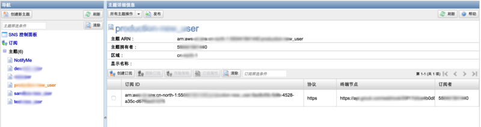

#AmazonSNS
**Amazon Simple Notification Service** ([Amazon SNS](http://docs.aws.amazon.com/zh_cn/sns/latest/dg/welcome.html)) 是一项 Web 服务，用于协调和管理向订阅终端节点或客户交付或发送消息的过程。
通过本集成，您可以将Amazon SNS 的主题订阅到Grouk。

1. 登录AWS后台SNS管理界面，选择或者创建您需要订阅的主题。
    
1. 

