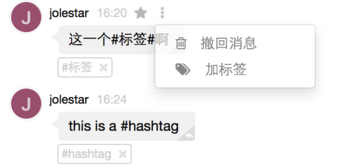
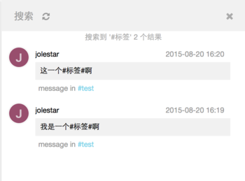

#使用标签来整理消息

Grouk通过永久保存消息记录以及强大的搜索功能，将团队聊天工具变为了一个动态知识库。但纯粹通过搜索，还是不容易找到重要的消息，所以我们提供了消息标签机制，用于消息的整理。

Grouk的标签和大家熟悉的微博或者twitter的话题标签一样，通过消息的文本输入即可实现。如果是中文，我们沿用了微博的标签规则，通过给标签的前后加“#”号来实现，如#标签#。如果是英文，则沿用了twitter的规则，通过 #tag 后加空格来切分。

如：

同时，通过消息的菜单可以给已经发布的消息增加标签。消息标签的权限不受限制，团队内任何人都可以给任何人的消息增加标签或者删除标签。

点击消息的标签可以通过标签进行搜索。

