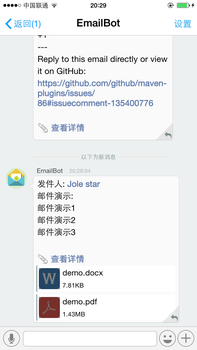
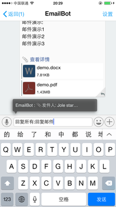
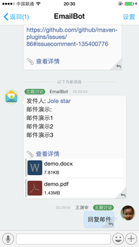
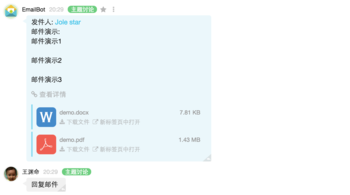
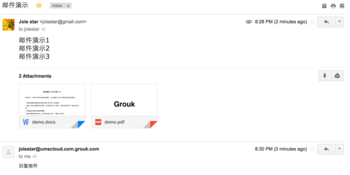

Grouk和邮件实现了无缝集成，Grouk会给每个用户以及群组分配一个独立的邮件地址，发邮件给该邮件地址，即可在Grouk中收取邮件（支持附件）。

* 个人的GroukEmail的规则是: 
        username@teamdomain+grouk.com
比如您的企业邮箱是 xiaoming@demo.com,您的GroukEmail就是xiaoming@demo.com.grouk.com
* 群组的邮件地址规则是:
        自定义群组ID@groups.teamdomain.grouk.com
比如您有个群组的自定义id是rd，GroukEmail的地址就是: rd@groups.demo.com.grouk.com。群组的邮件地址相当于一个邮件列表。

您可以将您的邮件转发到GroukEmail,这样就可以在Grouk中接受邮件。
同时Grouk支持应用内[回复邮件](reply_email.md)。

收到带附件的邮件

点击消息又下角的回复按钮，回复该邮件

回复回复完成

web版的邮件消息

Gmail中收到的回复

