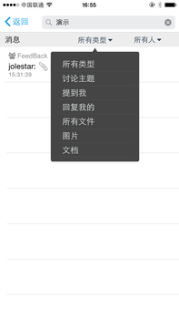
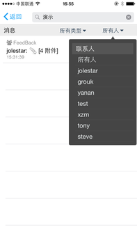

# 开始使用Grouk

## 注册

在Grouk，团队的标志是邮箱域名，相同邮箱域名的用户会自动加入同一个团队，所以您不需要提前创建团队。您只需要输入自己的企业邮箱，然后通过发给您邮箱的验证码直接登录即可。
点击 [同一域名同一团队](understanding_grouk_team.md) 了解更多。

## 群组

Grouk的群组虽然看起来和传统的IM群组区别不大，但使用一段时间你就会发现二者区别还是挺大的，主要表现在：

* Grouk的群组默认保留所有的历史聊天记录并提供云端检索功能。
* Grouk的群组默认新加入群的用户可以查看旧的历史消息。

这样做的目的是我们认为群组可以作为团队的动态知识库，wiki等文档系统是团队的静态知识库，而团队内的群聊则是动态的，及时更新的知识库。这样可以让新的同事更容易的了解和融入团队。

* [私密群和公开群](private_group_and_public_group.md)
* [邀请团队成员加入群组](invite_team_members_join_group.md)

## 邀请同事
[邀请同时加入Grouk](inviting_new_members.md)

## 私信

Grouk内的私信(单聊)机制和传统的IM区别不大，但在Grouk，您可以和团队内的同事直接聊天而不需要预先添加好友等确认机制。

## 消息

Grouk内的消息和传统IM的消息区别比较大，主要体现在:
1. Grouk的消息可以一次携带多个附件，像邮件一样。便于分享文件以及检索。
1. Grouk的消息可以编辑和删除（该功能下一版本上线）。聊天记录永久保存的情况下，需要机制允许用纠正自己的误操作。

了解更多
* [消息以及附件](message_and_attachment.md)
* [提到](mention.md)

## 群内回复以及话题讨论

Grouk在群聊内通过回复机制，实现了类似BBS的话题讨论和实时群聊的整合，避免了群内多个话题穿插讨论而带来的上下文丢失问题，也方便您对消息像邮件一样进行回复。

## 提醒设置
Grouk提供了强大的提醒设置机制，详情查看
[了解Grouk的提醒设置](understanding_grouk_notifications.md)

## 搜索
Grouk提供了强大的消息搜索功能，您可以通过关键词，发送者，群组，文件类型等条件进行检索消息和附件内容(pdf,office等文档格式支持)。同时Grouk支持支持从搜索结果跳转到历史会话记录，重现历史讨论场景。
您只能搜索别人发给你的消息和文件（包括单聊，您加入的私密群和公开群）。

  

## 多终端同步
Grouk支持多个终端同时登陆，每个终端的消息，未读数，以及收藏等都是实时同步的。避免了您切换设备导致的工作场景上下文丢失。
当然您也不必担心多终端导致的安全问题，我们支持通过一个设备将其他设备设置为离线（尚未上线）。

## 邮件
Grouk可以和邮件无缝集成，详细参看[邮件](email.md)

## 第三方集成
Grouk的第三方集成主要目的是将其他系统的消息通知到群组中，便于及时讨论以及追踪。比如 监控报警通知到群组可以及时沟通处理情况，持续集成工具的失败通知到群组中可以及时提醒代码提交者进行修复，等等。
创建第三方集成首先选择一个需要集成的应用，然后创建事件源(EventSource)。

Grouk的事件源分为公开和私密两种，公开的事件源允许任何人订阅，私密的只能创建者进行操作。
创建好事件源后，可以选择订阅给某个群组或者自己。
具体的事件源的创建方式请参看具体的应用集成说明，在这里主要介绍以下几种集成:

1. 邮件集成 创建后系统会分配一个邮件地址，向该地址发送邮件，就会发送一条消息给订阅者。主要使用场景：邮件转发提醒，和只支持邮件提醒的系统进行集成。
2. webhook webhook是一个带有token的接口地址，向该接口发送消息就会发送一条消息给订阅者。
3. rss 直接输入一个rss地址，如果该rss源有更新，就会发送消息给订阅者。