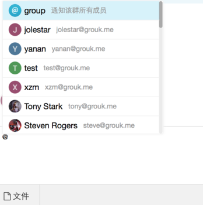
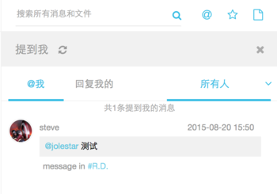

#提到(@)功能

在Grouk，您可以通过 @username 来提到某个同事，username即您同事的邮箱前缀。当您在聊天框内输入 @ 的时候会自动弹出菜单提示，便于您快速输入。当然您也可以直接输入，效果是一样的。

@group 是一个特殊的@指令，表示 @ 群组内所有成员。

Grouk的消息以及附件描述都支持 @功能，包括从第三方集成输入的消息的文本内容。

你可以通过搜索功能来过滤检索 @过自己的消息:

