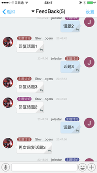
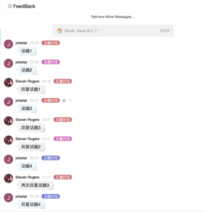
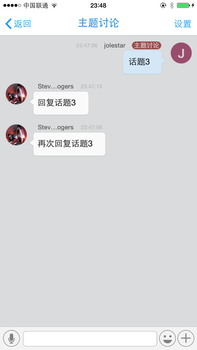

#消息回复和讨论主题
Grouk在聊天中通过回复机制，实现了类似论坛(BBS)的话题讨论和实时聊天的整合，避免了群内多个话题穿插讨论而带来的上下文丢失问题，也方便您对消息像邮件一样进行异步回复，深度讨论。

我们用传统的即时聊天工具的时候，经常会遇到消息被淹没，上下文丢失，消息无法像邮件一样定时异步处理，也无法就一个话题深入持续讨论。而邮件和论坛(BBS)的实时性和便利性又比及时聊天差好多。

所以Grouk通过消息回复，在聊天中实现了话题讨论，解决了这个问题。

Grouk中回复消息很容易，点击每个消息右下角的回复按钮发送消息即可。被回复的消息会变为讨论主题，消息顶部会有标志。同一颜色标志是同一话题的讨论。

点击讨论主题，会进入话题聊天窗口。在该窗口聊天的内容都是对主题消息的回复，该窗口也只能收到该对该主题的回复消息，避免收到其他话题讨论的干扰。

这个窗口的消息也是实时的。