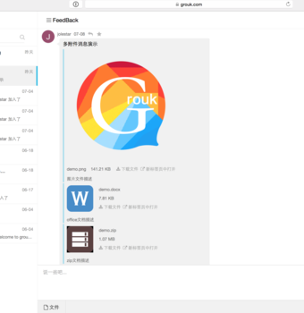

# 消息和附件

在Grouk，消息和附件的关系和邮件类似，一个消息可以携带多个附件，附件可以是任意类型的文件。

Grouk内的消息和传统IM的消息区别比较大，主要体现在:
* Grouk的消息可以一次携带多个附件，像邮件一样。便于分享文件以及检索。
* Grouk的消息可以编辑和删除（该功能下一版本上线）。聊天记录永久保存的情况下，需要机制允许用纠正自己的误操作。

iPhone版本多附件消息演示

web版本多附件消息演示

