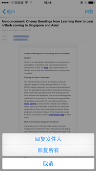

#回复邮件
通过邮件发送进来的消息，直接回复该消息同时会回复邮件。

默认的回复行为是回复全部，消息会发送给发件人，所有的除自己之外的收件人以及抄送人。

如果只想回复发件人，则点击邮件消息下方的查看详情，打开邮件后点击右上角的回复菜单，选择回复发件人(当前只有移动应用支持)。

iOS版本的回复邮件菜单

在单聊中回复的邮件，默认使用的发件人是您的Grouk邮箱。如果在群组中回复，默认使用的邮箱是群邮箱，这样当对方回复邮件时也会回复到群里。