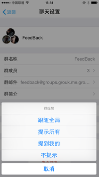

#了解Grouk的提醒设置

## 提醒设置
Grouk提供了强大的提醒设置机制，即可以避免被打扰，也能保证不遗漏重要消息。

对手机版本来说，提醒指当Grouk应用处于后台时，通过系统通知给你提醒新消息。对桌面/网页版来说，提醒指当您不在当前页面时，通过浏览器的通知功能进行提醒新消息。

Grouk的全局提醒设置，提供了以下选项：

* 提示所有
* 单聊或者提到和回复我的
* 不提示

同时每个群都可以单独设置提醒:
* 跟随全局 *该设置表示本群不特殊设置，跟随全局设置。比如全局设置为不提示，则本群也不提示。*
* 提示所有 *群内的所有消息，本设置会覆盖全局设置。*
* 提到和回复我的 *只有群内提到(@)和回复我的消息才提示，本设置也会覆盖全局设置。*
* 不提示 *本群的所有消息都不提示，本设置会覆盖全局设置。*

全局和群设置都会保存在云端，您在手机版上的设置同样对网页版也生效。我们认为统一的设置可以降低用户的理解和使用成本。如果您有其他看法可以反馈给我们。

